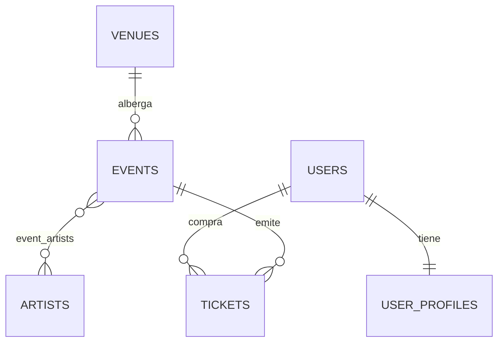

# PulsePass

Plataforma académica de eventos, artistas y entradas. Este repositorio contiene la **capa de persistencia** del sistema, implementada con Spring Boot, Spring Data JPA, Flyway y PostgreSQL, y validada con pruebas de integración usando Testcontainers.

## Tecnologías

| Tecnología | Versión / Uso |
|---|---|
| Java | 21 |
| Spring Boot | 4.1.1 |
| Spring Data JPA | Entidades y repositories (`JpaRepository`) |
| Flyway | Migraciones de esquema versionadas |
| PostgreSQL | Base de datos relacional |
| Testcontainers | Pruebas de integración contra un PostgreSQL real en contenedor |
| Lombok | Reducción de código repetitivo (`@Getter`, `@Setter`, `@NoArgsConstructor`) |
| Maven (wrapper) | Construcción y ejecución de pruebas |

## Estructura del proyecto

```
src
├── main
│   ├── java/com/pulsepass
│   │   ├── domain          # Enums y entidades JPA
│   │   └── repository      # Repositories con Query Methods y JPQL
│   └── resources/db/migration
│       ├── V1__create_schema.sql
│       ├── V2__insert_initial_artists.sql
│       └── V3__add_streaming_url_to_event.sql
└── test/java/com/pulsepass
    ├── AbstractIntegrationTest.java
    ├── EventArtistTest.java
    ├── TicketRepositoryTest.java
    ├── UserProfileTest.java
    └── VenueEventRelationTest.java
```

## Modelo de dominio

### Enums

| Enum | Valores |
|---|---|
| `EventCategory` | `MUSIC`, `SPORTS`, `TECHNOLOGY`, `EDUCATION`, `CULTURE`, `ENTERTAINMENT` |
| `EventStatus` | `DRAFT`, `PUBLISHED`, `SOLD_OUT`, `CANCELLED`, `FINISHED` |
| `TicketType` | `GENERAL`, `VIP`, `BACKSTAGE`, `STUDENT` |
| `TicketStatus` | `RESERVED`, `PAID`, `CANCELLED`, `USED` |

Todos los enums se persisten como texto (`@Enumerated(EnumType.STRING)`), de modo que reordenar o agregar valores no corrompe los datos existentes.

### Entidades

| Entidad | Tabla | Atributos principales |
|---|---|---|
| `Venue` | `venues` | `code` (único), `name`, `city`, `address`, `capacity`, `active` |
| `Event` | `events` | `eventCode` (único), `name`, `description`, `category`, `status`, `eventDate`, `minimumAge`, `streamingUrl` |
| `Artist` | `artists` | `stageName` (único), `country`, `genre`, `active` |
| `User` | `users` | `username` (único), `email` (único), `active` |
| `UserProfile` | `user_profiles` | `firstName`, `lastName`, `phone`, `city`, `birthDate` |
| `Ticket` | `tickets` | `ticketCode` (único), `type`, `price`, `status`, `purchaseDate` |

Además existe la tabla intermedia `event_artists`, que resuelve la relación muchos a muchos entre eventos y artistas. En total el esquema tiene **7 tablas**.

### Relaciones



- **Venue 1 — N Event**: un venue alberga muchos eventos; cada evento pertenece a exactamente un venue (`@ManyToOne` en `Event`, `@OneToMany` en `Venue`).
- **Event N — M Artist**: relación pura sin datos propios, modelada con `@ManyToMany` y la tabla intermedia `event_artists` (PK compuesta `event_id, artist_id`).
- **User 1 — 1 UserProfile**: relación `@OneToOne`, reforzada con `UNIQUE` sobre la FK `user_id` en `user_profiles`.
- **User 1 — N Ticket** y **Event 1 — N Ticket**: `Ticket` se modela como entidad propia (no como `@ManyToMany`) porque contiene atributos propios de la asociación: `ticketCode`, `type`, `price`, `status` y `purchaseDate` (regla BR-006).

### Decisiones de diseño

- Las claves primarias usan `GenerationType.IDENTITY`.
- Las asociaciones `@ManyToOne` y `@OneToOne` se cargan de forma perezosa (`FetchType.LAZY`).
- Los precios se guardan como `BigDecimal` con `precision = 10` y `scale = 2`.
- Los campos de negocio identificadores (`code`, `eventCode`, `ticketCode`, `stageName`, `username`, `email`) tienen restricción `UNIQUE`.

## Migraciones Flyway

| Migración | Propósito |
|---|---|
| `V1__create_schema.sql` | Crea las 7 tablas del modelo con PK, FK, UNIQUE, CHECK e índices. |
| `V2__insert_initial_artists.sql` | Inserta el catálogo semilla de 5 artistas de prueba. |
| `V3__add_streaming_url_to_event.sql` | Agrega `streaming_url` (nullable) a `events`, sin modificar V1 ya aplicada. |

Hibernate corre en modo `ddl-auto: validate`: nunca crea ni modifica el esquema, solo verifica que las entidades coincidan con lo que Flyway construyó. **Flyway es la única fuente de verdad del esquema** (NFR-002). Los cambios posteriores al esquema se hacen con una nueva migración (como `V3`), nunca editando una migración ya aplicada.

## Consultas implementadas

| Consulta | Mecanismo | Justificación |
|---|---|---|
| Venue por código | Query Method | Condición simple sobre un campo |
| Evento por `eventCode` | Query Method | Condición simple sobre un campo |
| Eventos `PUBLISHED` ordenados por fecha | Query Method | Un filtro + un orden, expresable por nombre |
| Eventos de un venue por código | Query Method (navega relación) | Navegación de una sola relación |
| Tickets de un usuario por email y status | Query Method (navega relación) | Navegación de una sola relación |
| Usuario por email (case-insensitive) | Query Method | `IgnoreCase` soportado nativamente |
| Eventos por artista | JPQL (`@Query`) | Requiere JOIN explícito sobre colección `@ManyToMany` + `DISTINCT` |
| Eventos por ciudad y artista | JPQL (`@Query`) | Múltiples asociaciones combinadas |
| Eventos recomendados | JPQL (`@Query`) | Filtros combinados + `DISTINCT` + orden + `LIKE` case-insensitive |
| Conteo de tickets `PAID` por evento | JPQL (`@Query` con `COUNT`) | Agregación, no expresable como Query Method simple |

**Criterio de elección:** se usan Query Methods cuando la consulta se expresa por nombre (un filtro, un orden o la navegación de una sola relación); se usa JPQL cuando hay JOIN explícito, varias asociaciones combinadas o agregaciones.

## Pruebas de integración

Las pruebas corren contra un **PostgreSQL real en contenedor** (Testcontainers), aplicando las migraciones Flyway igual que en un entorno real. Esto valida que el esquema, las entidades y las consultas funcionan en conjunto.

| Clase de prueba | Qué valida |
|---|---|
| `AbstractIntegrationTest` | Clase base con la configuración compartida de Testcontainers y PostgreSQL |
| `VenueEventRelationTest` | Relación Venue 1—N Event |
| `EventArtistTest` | Relación Event N—M Artist mediante `event_artists` |
| `UserProfileTest` | Relación User 1—1 UserProfile y restricción de unicidad |
| `TicketRepositoryTest` | Consultas sobre tickets y relaciones con User y Event |

En conjunto validan las relaciones entre entidades, las restricciones de unicidad y las consultas JPQL.

## Cómo ejecutar las pruebas

### Requisitos

- **JDK 21**
- **Docker** instalado y en ejecución (Testcontainers lo necesita para levantar PostgreSQL)

No hace falta instalar PostgreSQL de forma local.

### Comandos

Clonar el repositorio:

```bash
git clone https://github.com/Sharay0607/pulsepass-tercer-taller.git
cd pulsepass-tercer-taller
```

Ejecutar todas las pruebas con el Maven Wrapper:

```bash
# Linux / macOS
./mvnw test

# Windows
mvnw.cmd test
```

Ejecutar una clase de prueba específica:

```bash
./mvnw test -Dtest=TicketRepositoryTest
```

Al finalizar correctamente, Maven muestra `BUILD SUCCESS`.

> La primera ejecución puede tardar más porque Docker descarga la imagen de PostgreSQL.