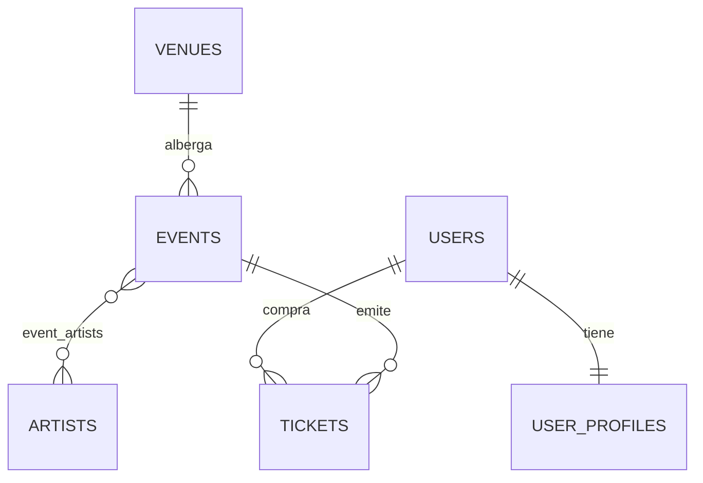

# PulsePass

Plataforma académica de eventos, artistas y entradas. Este repositorio contiene la **capa de persistencia** (Spring Boot, Spring Data JPA, Flyway, PostgreSQL, validada con Testcontainers) la **capa de servicios** (reglas de negocio, transacciones, DTOs y MapStruct, validada con unit tests JUnit 5 + Mockito + AssertJ) y la **capa de controladores** (API REST con Spring MVC, Bean Validation y manejo global de errores, validada con `@WebMvcTest` + MockMvc).

## Tecnologías

| Tecnología | Versión / Uso |
|---|---|
| Java | 21 |
| Spring Boot | 4.1.1 |
| Spring Data JPA | Entidades y repositories (`JpaRepository`) |
| Flyway | Migraciones de esquema versionadas |
| PostgreSQL | Base de datos relacional |
| Testcontainers | Pruebas de integración contra un PostgreSQL real en contenedor |
| Lombok | Reducción de código repetitivo (`@Getter`, `@Setter`, `@NoArgsConstructor`) |
| Spring Web MVC | `@RestController`, `ResponseEntity`, `@RestControllerAdvice` — capa de controladores |
| Bean Validation | `@Valid`, `@NotBlank`, `@NotNull`, `@Email`, `@Min`, `@Size` sobre los request DTOs |
| MapStruct | 1.6.x — mapeo Entity → DTO en la capa de servicios |
| JUnit 5 / Mockito / AssertJ | Unit tests de la capa de servicios (sin Spring ni base de datos) |
| `@WebMvcTest` / MockMvc | Pruebas de contrato HTTP de la capa de controladores (Services con `@MockitoBean`) |
| Maven (wrapper) | Construcción y ejecución de pruebas |

## Estructura del proyecto

```
src
├── main
│   ├── java/com/pulsepass
│   │   ├── domain          # Enums y entidades JPA
│   │   ├── repository      # Repositories con Query Methods y JPQL
│   │   ├── dto
│   │   │   ├── request     # Records de entrada (CreateEventRequest, RegisterUserRequest, PurchaseTicketRequest)
│   │   │   └── response    # Records de salida (VenueResponse, EventResponse, TicketResponse, ...)
│   │   ├── mapper          # Interfaces MapStruct (Entity → DTO)
│   │   ├── exception       # ResourceNotFound / DuplicateResource / BusinessRule / GlobalExceptionHandler
│   │   ├── service         # Interfaces + TicketPriceCalculator
│   │   │   └── impl        # Implementaciones @Service
│   │   └── controller      # Venue / Event / Artist / User / Ticket controllers (REST)
│   └── resources/db/migration
│       ├── V1__create_schema.sql
│       ├── V2__insert_initial_artists.sql
│       └── V3__add_streaming_url_to_event.sql
└── test/java/com/pulsepass
    ├── service             # Unit tests de la capa de servicios (Mockito)
    ├── controller          # Tests de la capa de controladores (@WebMvcTest + MockMvc)
    ├── AbstractIntegrationTest.java
    ├── EventArtistTest.java
    ├── TicketRepositoryTest.java
    ├── UserProfileTest.java
    └── VenueEventRelationTest.java
```

## Modelo de dominio

### Enums

| Enum | Valores |
|---|---|
| `EventCategory` | `MUSIC`, `SPORTS`, `TECHNOLOGY`, `EDUCATION`, `CULTURE`, `ENTERTAINMENT` |
| `EventStatus` | `DRAFT`, `PUBLISHED`, `SOLD_OUT`, `CANCELLED`, `FINISHED` |
| `TicketType` | `GENERAL`, `VIP`, `BACKSTAGE`, `STUDENT` |
| `TicketStatus` | `RESERVED`, `PAID`, `CANCELLED`, `USED` |

Todos los enums se persisten como texto (`@Enumerated(EnumType.STRING)`), de modo que reordenar o agregar valores no corrompe los datos existentes.

### Entidades

| Entidad | Tabla | Atributos principales |
|---|---|---|
| `Venue` | `venues` | `code` (único), `name`, `city`, `address`, `capacity`, `active` |
| `Event` | `events` | `eventCode` (único), `name`, `description`, `category`, `status`, `eventDate`, `minimumAge`, `streamingUrl` |
| `Artist` | `artists` | `stageName` (único), `country`, `genre`, `active` |
| `User` | `users` | `username` (único), `email` (único), `active` |
| `UserProfile` | `user_profiles` | `firstName`, `lastName`, `phone`, `city`, `birthDate` |
| `Ticket` | `tickets` | `ticketCode` (único), `type`, `price`, `status`, `purchaseDate` |

Además existe la tabla intermedia `event_artists`, que resuelve la relación muchos a muchos entre eventos y artistas. En total el esquema tiene **7 tablas**.

### Relaciones


```mermaid
erDiagram
    VENUES ||--o{ EVENTS : "alberga"
    EVENTS }o--o{ ARTISTS : "event_artists"
    USERS ||--|| USER_PROFILES : "tiene"
    USERS ||--o{ TICKETS : "compra"
    EVENTS ||--o{ TICKETS : "emite"
```

- **Venue 1 — N Event**: un venue alberga muchos eventos; cada evento pertenece a exactamente un venue (`@ManyToOne` en `Event`, `@OneToMany` en `Venue`).
- **Event N — M Artist**: relación pura sin datos propios, modelada con `@ManyToMany` y la tabla intermedia `event_artists` (PK compuesta `event_id, artist_id`).
- **User 1 — 1 UserProfile**: relación `@OneToOne`, reforzada con `UNIQUE` sobre la FK `user_id` en `user_profiles`.
- **User 1 — N Ticket** y **Event 1 — N Ticket**: `Ticket` se modela como entidad propia (no como `@ManyToMany`) porque contiene atributos propios de la asociación: `ticketCode`, `type`, `price`, `status` y `purchaseDate` (regla BR-006).

### Decisiones de diseño

- Las claves primarias usan `GenerationType.IDENTITY`.
- Las asociaciones `@ManyToOne` y `@OneToOne` se cargan de forma perezosa (`FetchType.LAZY`).
- Los precios se guardan como `BigDecimal` con `precision = 10` y `scale = 2`.
- Los campos de negocio identificadores (`code`, `eventCode`, `ticketCode`, `stageName`, `username`, `email`) tienen restricción `UNIQUE`.

## Migraciones Flyway

| Migración | Propósito |
|---|---|
| `V1__create_schema.sql` | Crea las 7 tablas del modelo con PK, FK, UNIQUE, CHECK e índices. |
| `V2__insert_initial_artists.sql` | Inserta el catálogo semilla de 5 artistas de prueba. |
| `V3__add_streaming_url_to_event.sql` | Agrega `streaming_url` (nullable) a `events`, sin modificar V1 ya aplicada. |

Hibernate corre en modo `ddl-auto: validate`: nunca crea ni modifica el esquema, solo verifica que las entidades coincidan con lo que Flyway construyó. **Flyway es la única fuente de verdad del esquema** (NFR-002). Los cambios posteriores al esquema se hacen con una nueva migración (como `V3`), nunca editando una migración ya aplicada.

## Consultas implementadas

| Consulta | Mecanismo | Justificación |
|---|---|---|
| Venue por código | Query Method | Condición simple sobre un campo |
| Evento por `eventCode` | Query Method | Condición simple sobre un campo |
| Eventos `PUBLISHED` ordenados por fecha | Query Method | Un filtro + un orden, expresable por nombre |
| Eventos de un venue por código | Query Method (navega relación) | Navegación de una sola relación |
| Tickets de un usuario por email y status | Query Method (navega relación) | Navegación de una sola relación |
| Usuario por email (case-insensitive) | Query Method | `IgnoreCase` soportado nativamente |
| Eventos por artista | JPQL (`@Query`) | Requiere JOIN explícito sobre colección `@ManyToMany` + `DISTINCT` |
| Eventos por ciudad y artista | JPQL (`@Query`) | Múltiples asociaciones combinadas |
| Eventos recomendados | JPQL (`@Query`) | Filtros combinados + `DISTINCT` + orden + `LIKE` case-insensitive |
| Conteo de tickets `PAID` por evento | JPQL (`@Query` con `COUNT`) | Agregación, no expresable como Query Method simple |
| Tickets PAID de un evento por eventCode | Query Method (navega relación) | Un filtro por estado navegando la relación Ticket → Event |
| Tickets de eventos futuros | JPQL (`@Query`) | Filtro sobre la fecha del evento asociado + orden cronológico |

**Criterio de elección:** se usan Query Methods cuando la consulta se expresa por nombre (un filtro, un orden o la navegación de una sola relación); se usa JPQL cuando hay JOIN explícito, varias asociaciones combinadas o agregaciones.

## Pruebas de integración

Las pruebas corren contra un **PostgreSQL real en contenedor** (Testcontainers), aplicando las migraciones Flyway igual que en un entorno real. Esto valida que el esquema, las entidades y las consultas funcionan en conjunto.

| Clase de prueba | Qué valida |
|---|---|
| `AbstractIntegrationTest` | Clase base con la configuración compartida de Testcontainers y PostgreSQL |
| `VenueEventRelationTest` | Relación Venue 1—N Event |
| `EventArtistTest` | Relación Event N—M Artist mediante `event_artists` |
| `UserProfileTest` | Relación User 1—1 UserProfile y restricción de unicidad |
| `TicketRepositoryTest` | Consultas sobre tickets y relaciones con User y Event |

En conjunto validan las relaciones entre entidades, las restricciones de unicidad y las consultas JPQL.

## Cómo ejecutar las pruebas

### Requisitos

- **JDK 21**
- **Docker** instalado y en ejecución (Testcontainers lo necesita para levantar PostgreSQL)

No hace falta instalar PostgreSQL de forma local.

### Comandos

Clonar el repositorio:

```bash
git clone https://github.com/Sharay0607/pulsepass-tercer-taller.git
cd pulsepass-tercer-taller
```

Ejecutar todas las pruebas con el Maven Wrapper:

```bash
# Linux / macOS
./mvnw test

# Windows
mvnw.cmd test
```

Ejecutar una clase de prueba específica:

```bash
./mvnw test -Dtest=TicketRepositoryTest
```

Al finalizar correctamente, Maven muestra `BUILD SUCCESS`.

> La primera ejecución puede tardar más porque Docker descarga la imagen de PostgreSQL.

---

# Capa de servicios

Frontera entre la capa de exposición (controllers) y el modelo persistente. Aplica reglas de negocio, coordina repositories, controla transacciones y **nunca devuelve entidades JPA**: siempre DTOs (`record`) construidos con MapStruct.

```
Controller → DTOs → Service (interface + impl) → Repository → Entity → PostgreSQL
                                   ├── Mapper (MapStruct)
                                   └── Reglas de negocio + @Transactional
```

## Servicios

| Servicio | Operaciones | Reglas principales |
|---|---|---|
| `VenueService` | `findByCode`, `findActiveVenues` | BR-VENUE-001..002 |
| `ArtistService` | `findById`, `findByStageName`, `findActiveArtists` | BR-ARTIST-001..002 |
| `EventService` | `create`, `findByCode`, `findPublishedEvents`, `publish`, `addArtist`, `findByArtist` | BR-EVENT-001..011 |
| `UserService` | `register` (User + UserProfile), `findByEmail`, `findByUsername` | BR-USER-001..005 |
| `TicketService` | `purchase`, `findByCode`, `findByUserEmail`, `findPaidTicketsByEvent`, `cancel`, `markAsUsed` | BR-TICKET-001..014 |

## Excepciones

| Excepción | Cuándo |
|---|---|
| `ResourceNotFoundException` | El recurso no existe (`Event not found: CMF-2026`) |
| `DuplicateResourceException` | Conflicto de unicidad (`Username already exists: andrea`) |
| `BusinessRuleException` | El recurso existe pero la operación no es válida (`User does not meet minimum age.`) |

## Flujo de compra (`TicketService.purchase`)

Una sola transacción (`@Transactional`): si cualquier paso falla se hace rollback completo.

```
Buscar User → ¿activo? → Buscar Event → ¿PUBLISHED? → ¿fecha futura? → ¿cumple edad (a la fecha del evento)?
→ ¿paidTickets < capacity? → Calcular precio → Crear Ticket (PAID) → save
→ si paidTickets + 1 == capacity → Event = SOLD_OUT (misma transacción) → TicketResponse
```

## Estrategia de precios

El precio **nunca** viene del cliente. `TicketPriceCalculator` (encapsulado y con tests propios) calcula `BigDecimal` = precio base × multiplicador:

| Tipo | Multiplicador |
|---|---|
| `GENERAL` | 1.00 |
| `STUDENT` | 0.70 |
| `VIP` | 2.00 |
| `BACKSTAGE` | 3.50 |

El precio base se configura con `pulsepass.pricing.base-price` (por defecto `50000.00`).

## Cambios en repositories (aditivos)

Se agregaron métodos que la capa de servicios necesita; no se modificó ninguno existente:
`VenueRepository.findByActiveTrueOrderByNameAsc`, `ArtistRepository.findByStageNameIgnoreCase` / `findByActiveTrueOrderByStageNameAsc`, `EventRepository.existsByEventCode`, `UserRepository.existsByUsername` / `existsByEmailIgnoreCase`, `TicketRepository.findByUser_EmailIgnoreCaseOrderByPurchaseDateDesc`.

## Unit tests de servicios

Arquitectura: `JUnit 5 → Service real → Repository mock + Mapper mock` (sin `@SpringBootTest`, sin PostgreSQL, sin Testcontainers). Cada test sigue ARRANGE / ACT / ASSERT y usa `when`, `verify`, `verify(..., never())`, `any()`, `eq()`.

| Clase | Cubre |
|---|---|
| `EventServiceImplTest` | TEST-EVENT-001..008 + duplicados, edad mínima, `addArtist` (BR-EVENT-010..011) |
| `UserServiceImplTest` | TEST-USER-001..004 + normalización de email, consultas |
| `TicketServiceImplTest` | TEST-TICKET-001..012 + edad en fecha del evento + escenario AC-004..AC-009 (aforo 3) |
| `TicketPriceCalculatorTest` | Multiplicadores, redondeo, precio nunca negativo |
| `VenueServiceImplTest`, `ArtistServiceImplTest` | Consultas y errores |

```bash
# Solo unit tests de servicios (no requieren Docker)
./mvnw test -Dtest='*ServiceImplTest,TicketPriceCalculatorTest'

# Todo (los tests de persistencia sí requieren Docker)
./mvnw clean test
```

---

# Capa de controladores (API REST)

Expone por HTTP los 20 métodos públicos de los Services. Los controllers son **delgados**: reciben el JSON, validan la entrada, delegan en el Service y devuelven el código HTTP correcto. No contienen reglas de negocio, no conocen los repositories y **nunca devuelven entidades JPA**: solo DTOs (`record`).

```
HTTP Request → Controller → (Bean Validation) → Service → Repository → PostgreSQL
HTTP Response ← Controller ← DTO / Excepción ← GlobalExceptionHandler (ErrorResponse)
```

| Capa | Responsabilidad |
|---|---|
| **Controller** | Preocupaciones HTTP: rutas, status, JSON, validación estructural |
| **Service** | Reglas de negocio (usuario activo, evento publicado, edad mínima, capacidad, transiciones...) |
| **Repository** | Persistencia |

## Endpoints

Base URL: `http://localhost:8080`

### Venues — `VenueController`

| Método | Endpoint | Service | Éxito | Errores |
|---|---|---|:---:|:---:|
| `GET` | `/api/venues/{code}` | `findByCode` | `200` | `404` |
| `GET` | `/api/venues/active` | `findActiveVenues` | `200` | — |

### Eventos — `EventController`

| Método | Endpoint | Service | Éxito | Errores |
|---|---|---|:---:|:---:|
| `POST` | `/api/events` | `EventService.create` | `201` | `400` `404` `409` |
| `GET` | `/api/events/{eventCode}` | `findByCode` | `200` | `404` |
| `GET` | `/api/events/published` | `findPublishedEvents` | `200` | — |
| `PATCH` | `/api/events/{eventCode}/publish` | `publish` | `200` | `404` `409` |
| `POST` | `/api/events/{eventCode}/artists/{artistId}` | `addArtist` | `200` | `400` `404` `409` |
| `GET` | `/api/events/by-artist?stageName=...` | `findByArtist` | `200` | `400` |
| `GET` | `/api/events/{eventCode}/tickets/paid` | `TicketService.findPaidTicketsByEvent` | `200` | — |

### Artistas — `ArtistController`

| Método | Endpoint | Service | Éxito | Errores |
|---|---|---|:---:|:---:|
| `GET` | `/api/artists/{id}` | `findById` | `200` | `400` `404` |
| `GET` | `/api/artists/by-stage-name?stageName=...` | `findByStageName` | `200` | `400` `404` |
| `GET` | `/api/artists/active` | `findActiveArtists` | `200` | — |

### Usuarios — `UserController`

| Método | Endpoint | Service | Éxito | Errores |
|---|---|---|:---:|:---:|
| `POST` | `/api/users` | `register` | `201` | `400` `409` |
| `GET` | `/api/users/by-email?email=...` | `findByEmail` | `200` | `400` `404` |
| `GET` | `/api/users/by-username?username=...` | `findByUsername` | `200` | `400` `404` |

### Tickets — `TicketController`

| Método | Endpoint | Service | Éxito | Errores |
|---|---|---|:---:|:---:|
| `POST` | `/api/tickets` | `purchase` | `201` | `400` `404` `409` |
| `GET` | `/api/tickets/{ticketCode}` | `findByCode` | `200` | `404` |
| `GET` | `/api/tickets/by-user?email=...` | `findByUserEmail` | `200` | `400` |
| `PATCH` | `/api/tickets/{ticketCode}/cancel` | `cancel` | `200` | `404` `409` |
| `PATCH` | `/api/tickets/{ticketCode}/use` | `markAsUsed` | `200` | `404` `409` |

> **Cobertura:** Venue 2 + Event 6 + Artist 3 + User 3 + Ticket 6 = **20 operaciones**, todas con forma HTTP.

## Códigos HTTP

| Código | Uso |
|:---:|---|
| `200 OK` | Consultas y actualizaciones correctas (incluye asociar un artista a un evento) |
| `201 Created` | Creación de evento, usuario o ticket |
| `400 Bad Request` | Bean Validation, JSON mal formado, enum inexistente, parámetro faltante o de tipo inválido |
| `404 Not Found` | `ResourceNotFoundException` (recurso inexistente) |
| `409 Conflict` | `DuplicateResourceException` o `BusinessRuleException` |
| `500 Internal Server Error` | Error inesperado (nunca expone detalles internos) |

## Validación de entrada

Validación **estructural** con Bean Validation (`@Valid @RequestBody`) en los request DTOs. Las reglas de negocio siguen en el Service. Las longitudes máximas coinciden con las columnas de `V1__create_schema.sql`.

| DTO | Campo | Validación |
|---|---|---|
| `CreateEventRequest` | `eventCode`, `name`, `venueCode` | `@NotBlank` + `@Size(max)` |
| | `description` | `@Size(max = 1000)` |
| | `category`, `eventDate` | `@NotNull` |
| | `minimumAge` | `@NotNull` + `@Min(0)` |
| `RegisterUserRequest` | `username`, `firstName`, `lastName` | `@NotBlank` + `@Size(max)` |
| | `email` | `@NotBlank` + `@Email` |
| | `birthDate` | `@NotNull` |
| `PurchaseTicketRequest` | `userEmail` | `@NotBlank` + `@Email` |
| | `eventCode` | `@NotBlank` |
| | `type` | `@NotNull` |

| Lo valida el **Controller** | Lo valida el **Service** |
|---|---|
| Campo obligatorio, formato de email, longitud, valor mínimo, JSON mal formado | Usuario activo, evento existente y publicado, edad mínima, capacidad, transiciones de estado, duplicados |

## Contrato de errores

Todos los errores usan el mismo `ErrorResponse`, generado en un único `GlobalExceptionHandler` (`@RestControllerAdvice`):

```json
{
  "timestamp": "2026-10-04T20:00:00",
  "status": 400,
  "error": "Bad Request",
  "message": "Validation failed",
  "details": {
    "eventCode": "Event code is required",
    "venueCode": "Venue code is required"
  }
}
```

`details` es un mapa `campo → problema`; queda vacío (`{}`) cuando el error no pertenece a un campo concreto.

| Situación | Excepción | HTTP | `message` |
|---|---|:---:|---|
| Bean Validation | `MethodArgumentNotValidException` | `400` | `Validation failed` |
| JSON mal formado / enum inexistente | `HttpMessageNotReadableException` | `400` | `Malformed or invalid JSON request` |
| Parámetro con tipo inválido (`artistId=abc`) | `MethodArgumentTypeMismatchException` | `400` | `Invalid request parameter` |
| Falta un query param obligatorio | `MissingServletRequestParameterException` | `400` | `Missing request parameter` |
| Recurso inexistente | `ResourceNotFoundException` | `404` | Mensaje del Service |
| Ruta inexistente | `NoResourceFoundException` | `404` | `Resource not found` |
| Método HTTP no soportado | `HttpRequestMethodNotSupportedException` | `405` | `HTTP method not supported for this endpoint` |
| Duplicado | `DuplicateResourceException` | `409` | Mensaje del Service |
| Regla de negocio | `BusinessRuleException` | `409` | Mensaje del Service |
| Cualquier otro error | `Exception` | `500` | `An unexpected error occurred` |

> Los últimos handlers (ruta inexistente, método no soportado, parámetros) evitan que esos casos terminen como un `500` engañoso.

## Pruebas de la capa de controladores

Cada controller se prueba **aislado**: `@WebMvcTest` carga solo la capa web, los Services son `@MockitoBean` y las peticiones se simulan con `MockMvc`. No hay PostgreSQL, Docker ni lógica real de Service.

```
HTTP Request → Controller (real) → Mock Service → HTTP Response
```

Cada test valida el status, el `Content-Type`, los campos JSON con `jsonPath`, la interacción con el Service (`verify`) y, en los requests inválidos, que el Service **nunca** se invoca (`verify(..., never())`).

| Clase | Tests | Cubre |
|---|:---:|---|
| `VenueControllerTest` | 5 | TEST-CTRL-VEN-001..003 · `500` sin filtrar detalles · `405` |
| `ArtistControllerTest` | 7 | TEST-CTRL-ART-001..004 · `404` por stageName · `400` por id no numérico y param faltante |
| `UserControllerTest` | 10 | TEST-CTRL-USR-001..005 · campos obligatorios · fecha inválida · email duplicado sin filtrar internos |
| `EventControllerTest` | 22 | TEST-CTRL-EVT-001..009 · TEST-CTRL-TKT-007 · validaciones (`@Min`, `@Size`, enum) · `409`/`404` de create, publish y addArtist |
| `TicketControllerTest` | 18 | TEST-CTRL-TKT-001..006, 008..011 · edad mínima · sin cupos · lista vacía · `404` en cancel/use |
| **Total** | **62** | |

### Matriz de trazabilidad: Service → Endpoint → Test

| Método de Service | Endpoint | Test principal |
|---|---|---|
| `VenueService.findByCode` | `GET /api/venues/{code}` | `shouldReturnVenueByCode` · `shouldReturn404WhenVenueDoesNotExist` |
| `VenueService.findActiveVenues` | `GET /api/venues/active` | `shouldReturnActiveVenues` |
| `EventService.create` | `POST /api/events` | `shouldCreateEvent` · `shouldReturn400WhenEventRequestIsInvalid` |
| `EventService.findByCode` | `GET /api/events/{eventCode}` | `shouldReturnEventByCode` · `shouldReturn404WhenEventDoesNotExist` |
| `EventService.findPublishedEvents` | `GET /api/events/published` | `shouldReturnPublishedEvents` |
| `EventService.publish` | `PATCH /api/events/{eventCode}/publish` | `shouldPublishEvent` · `shouldReturn409WhenEventCannotBePublished` |
| `EventService.addArtist` | `POST /api/events/{eventCode}/artists/{artistId}` | `shouldAddArtistToEvent` |
| `EventService.findByArtist` | `GET /api/events/by-artist` | `shouldReturnEventsByArtist` |
| `ArtistService.findById` | `GET /api/artists/{id}` | `shouldReturnArtistById` · `shouldReturn404WhenArtistIdDoesNotExist` |
| `ArtistService.findByStageName` | `GET /api/artists/by-stage-name` | `shouldReturnArtistByStageName` |
| `ArtistService.findActiveArtists` | `GET /api/artists/active` | `shouldReturnActiveArtists` |
| `UserService.register` | `POST /api/users` | `shouldRegisterUser` · `shouldReturn400WhenEmailIsInvalid` · `shouldReturn409WhenUsernameIsDuplicated` |
| `UserService.findByEmail` | `GET /api/users/by-email` | `shouldReturnUserByEmail` |
| `UserService.findByUsername` | `GET /api/users/by-username` | `shouldReturnUserByUsername` |
| `TicketService.purchase` | `POST /api/tickets` | `shouldPurchaseTicket` · `shouldReturn400WhenPurchaseRequestIsInvalid` · `shouldReturn404WhenUserDoesNotExist` · `shouldReturn409WhenUserDoesNotMeetMinimumAge` |
| `TicketService.findByCode` | `GET /api/tickets/{ticketCode}` | `shouldReturnTicketByCode` |
| `TicketService.findByUserEmail` | `GET /api/tickets/by-user` | `shouldReturnTicketsByUserEmail` |
| `TicketService.findPaidTicketsByEvent` | `GET /api/events/{eventCode}/tickets/paid` | `shouldReturnPaidTicketsOfEvent` |
| `TicketService.cancel` | `PATCH /api/tickets/{ticketCode}/cancel` | `shouldCancelPaidTicket` · `shouldReturn409WhenCancellingUsedTicket` |
| `TicketService.markAsUsed` | `PATCH /api/tickets/{ticketCode}/use` | `shouldMarkPaidTicketAsUsed` · `shouldReturn409WhenUsingCancelledTicket` |

### Ejecutar las pruebas de controladores

```bash
# Solo la capa de controladores (rápido, sin Docker)
./mvnw test -Dtest='*ControllerTest'

# Toda la suite (los tests de persistencia sí necesitan Docker)
./mvnw clean test
```

Resultado esperado: `BUILD SUCCESS`.

## Ejecutar la API

Requiere una instancia de PostgreSQL accesible con los datos de `application.properties` (Flyway aplica las migraciones al arrancar):

```bash
./mvnw spring-boot:run     # API en http://localhost:8080
```

### Ejemplos con curl

> En **PowerShell** usa `curl.exe` (no `curl`, que es un alias de otro comando) o Postman / Insomnia / Bruno. Los códigos son de ejemplo.

```bash
# Venue
curl http://localhost:8080/api/venues/VEN-SMR-01

# Crear un evento (201)
curl -X POST http://localhost:8080/api/events -H "Content-Type: application/json" -d '{
  "eventCode": "CMF-2026",
  "name": "Caribbean Music Fest 2026",
  "description": "Festival de musica",
  "category": "MUSIC",
  "eventDate": "2026-12-15T20:00:00",
  "minimumAge": 18,
  "venueCode": "VEN-SMR-01"
}'

# Publicarlo (200) y asociar un artista (200)
curl -X PATCH http://localhost:8080/api/events/CMF-2026/publish
curl -X POST  http://localhost:8080/api/events/CMF-2026/artists/1

# Cartelera
curl http://localhost:8080/api/events/published

# Registrar un usuario (201)
curl -X POST http://localhost:8080/api/users -H "Content-Type: application/json" -d '{
  "username": "andrea", "email": "andrea@email.com", "firstName": "Andrea",
  "lastName": "Gomez", "birthDate": "2000-05-10"
}'

# Comprar un ticket (201) y consultar los de un usuario
curl -X POST http://localhost:8080/api/tickets -H "Content-Type: application/json" \
  -d '{"userEmail": "andrea@email.com", "eventCode": "CMF-2026", "type": "VIP"}'
curl "http://localhost:8080/api/tickets/by-user?email=andrea@email.com"

# Cancelar / usar un ticket (200)
curl -X PATCH http://localhost:8080/api/tickets/TCK-XXXXXXXXXXXX/cancel
curl -X PATCH http://localhost:8080/api/tickets/TCK-XXXXXXXXXXXX/use
```

Para provocar errores a propósito:

```bash
curl http://localhost:8080/api/venues/VEN-XXX                 # 404
curl -X POST http://localhost:8080/api/users -H "Content-Type: application/json" -d '{}'   # 400 (details por campo)
curl http://localhost:8080/api/artists/abc                    # 400 (id no numérico)
curl "http://localhost:8080/api/events/by-artist"             # 400 (falta stageName)
```

## Decisiones de diseño (controladores)

| Decisión | Motivo |
|---|---|
| `POST` de creación → `201` | La operación crea un recurso nuevo; `200` no lo comunica. |
| `POST .../artists/{artistId}` → `200` | Asocia dos recursos que ya existen: no se crea un recurso nuevo (PRD §8.2). |
| Transiciones con `PATCH` (`publish`, `cancel`, `use`) | Cambian solo el estado del recurso, no lo reemplazan. |
| Email y nombres como **query param** (`?email=`) | Los `.` y `@` en un path variable dan problemas de enrutamiento; además el path queda para identificadores. |
| Rutas literales (`/active`, `/published`, `/by-user`...) conviven con `/{id}` | Spring prioriza la ruta literal sobre la variable: no hay ambigüedad. |
| `/api/events/{eventCode}/tickets/paid` vive en `EventController` | La URL cuelga del evento (PRD §8.5); por eso ese controller recibe también `TicketService`. |
| Validación **estructural** en el DTO, **de negocio** en el Service | El Controller no debe conocer reglas del dominio (CTRL-001, CTRL-006). |
| Un único `GlobalExceptionHandler` | Sin `try/catch` repetidos; todos los errores comparten formato (CTRL-007, CTRL-008). |
| Mensajes del `500` genéricos | No exponer stack traces, SQL ni estructura interna (NFR-CTRL-007). |
